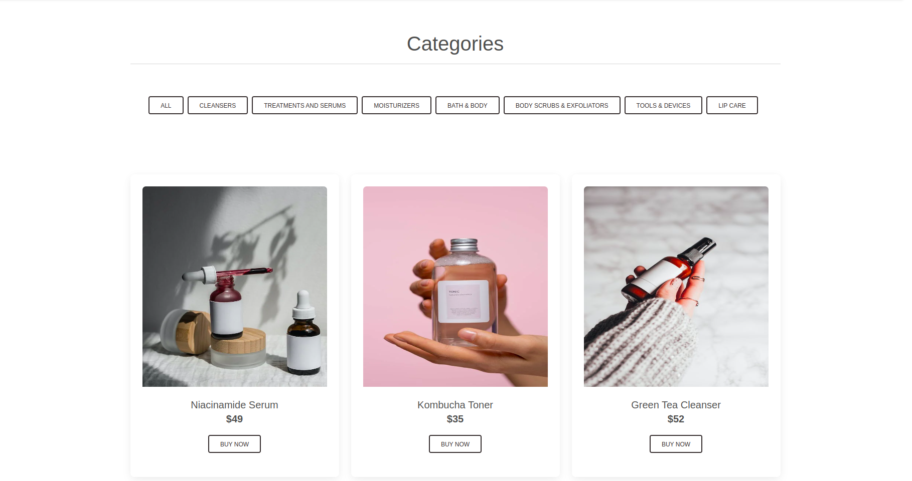
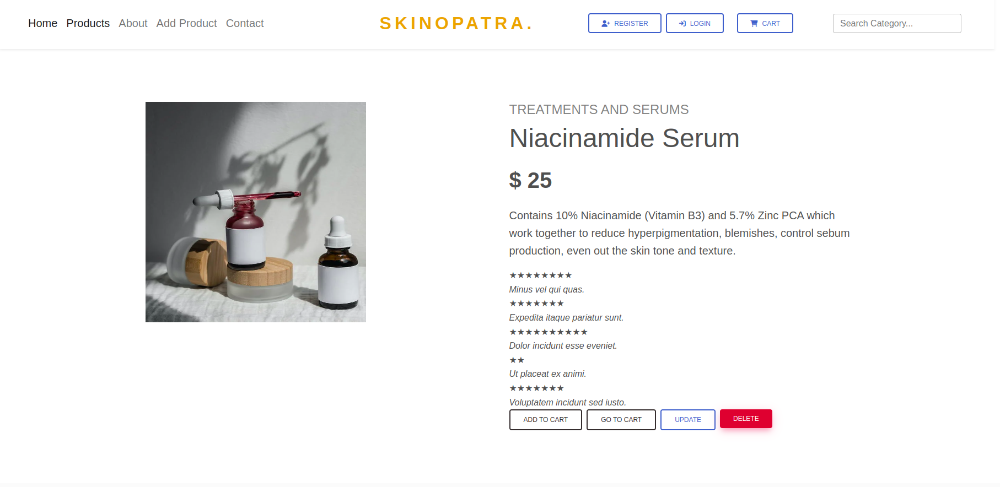
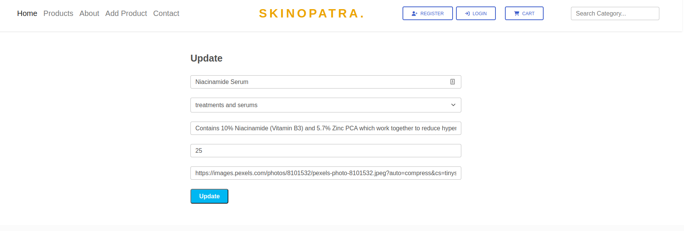

# Project Description
Welcome to Skinopatra, a skincare brand that has cautiously created idea of conveying nature to your doorstep.We trust that nobody ought to need to trade off their wellbeing for beauty.
## Goals
* Implement a mini web app to practice components, props, state, events, and data fetching in react.
* Implement all CRUD methods.
## SetUp Instruction
For this project, you’ll be building out a React application that displays a list of available products,updates the product details, deletes the product, posts the product to site and backend among other features. The text editor used is Visual Studio Code.
## Requirements
1. It is a single page application (only one index.html file) created using create-react-app
2. App uses at least 5 components in a way that keeps code well organized
3. There are at least 3 client-side routes using react-routerLinks to an external site. A json-server is used to create a RESTful API for the backend and makes a GET, POST, PATCH and DELETE request to the json server. 
## Technologies Used
1. HTML
2. MdBootstrap
3. React
4. CSS
5. JavaScript
6. Font Awesome
7. Bootstrap
8. SweetAlert 
## Setup
1. Install nvm on your machine, if not already installed.
2. Fork the repository.
3. Create a new branch in your terminal.
4. Download the files.
5. Initialize the db.json file from the console in the adjacent directory.Run this command  to get the backend started: json-server --watch db.json --port 8001
6. Run `npm start` on your machine to initialize the project.This will run your React app on port `3000`.

## Endpoints
JSON file linked using Railway to retrieve the product data and app deployed on Netlify.
## Core Deliverables 
A user should be able to:
 * See images of all products rendered in product collection from the database
 * add an Item to the list of products,functionality to be restricted to the admin side
 * search for product categories 
 * delete an Item from the list of products
 * update item details 
## Screenshots
 * 
 * 
 * 
 * 

## Author & License
Linet Oliech is the sole contributor to this project. Project is licensed and author does not grant permissions for Commercial use, Reproduction, Distribution, Modification, Patent and Private use.Copyright (c) 2023 Linet Oliech

## Contact Information
For any queries or enquiries feel free to reach out at oliechlin@gmail.com

